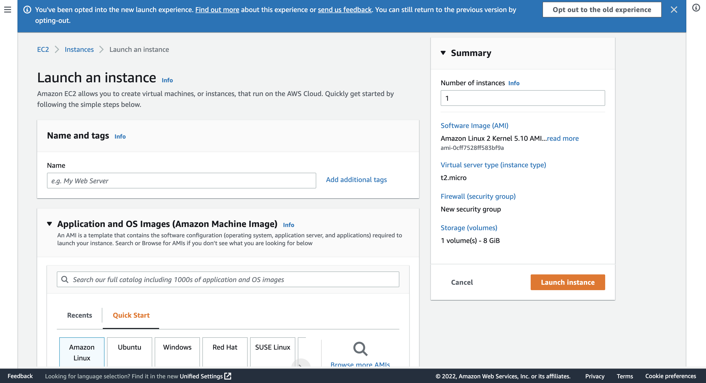
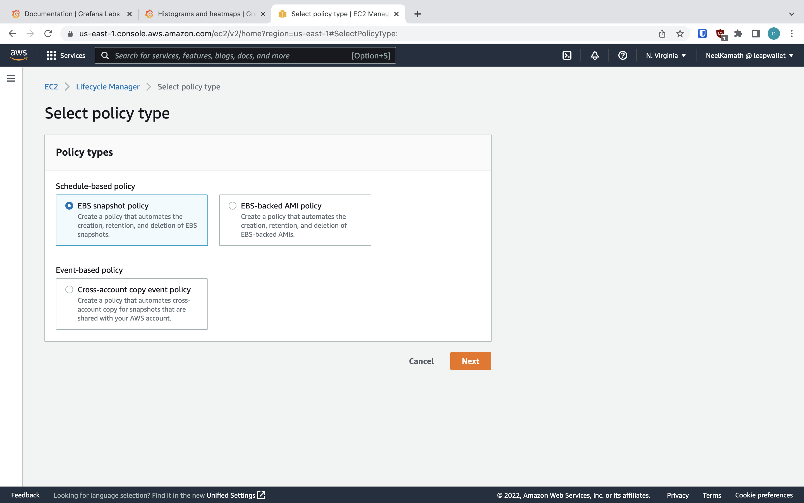

# AWS Configuration

Using a serverless solution such as AWS Fargate would've been more scalable since the primary purpose of an archive node
is to serve API requests. However, since a blockchain node is a DB and API server combined, it's impossible to use a
serverless solution. This is because a serverless solution requires the DB to be scaled separately from the API server.
Since the blockchain combines the two, the DB would get corrupted because the API servers would all be writing to the
DB, and the DB isn't engineered to handle duplicate writes.

## AWS EC2 Configuration

Configure an AWS EC2 instance by using the _Launch an instance_ page which looks similar to the following screenshot:

### Name

We recommend something similar to _Juno Mainnet Archive Node_.

### AMI

- Any OS is fine; Ubuntu is the best.
- The storage device must be fast; an SSD is recommended.
- The architecture must be 64-bit (x86).

We recommend using the AMI with the ID `ami-052efd3df9dad4825`.

### Instance Type

For a validator, the recommended RAM is 32 GB, and the recommended number of CPU cores is 4. Since archive nodes don't
need more than half of that, we'll use the `t3a.xlarge` instance type because it's the cheapest options that fits our
needs.

### Key Pair

It's up to you whether you use a key pair, and which specifications the key pair uses. We recommend you use a key pair,
and with the following specifications:

- **Key pair name**: We recommend something similar to _juno-mainnet-archive-node_.
- **Key pair type**: RSA
- **Private key file format**: `.pem`

### Network Settings

- **VPC**: Unless you have reasons to, use the default VPC.
- **Subnet**: Unless you have reasons to, set the **Subnet** to **No preference**.
- **Auto-assign public IP**: **Enable**
- **Firewall (security groups)**:
    - **Security group name**: We recommend something similar to _juno-mainnet-archive-node_.
    - **Description**: We recommend something similar to _Juno mainnet archive node on AWS EC2_.
    - **Inbound security groups rules** (We recommend adding the following security groups but none of them are
      mandatory.):
        - **Security group rule 1**:
            - **Type**: **SSH**
            - **Source type**: **My IP**
            - **Description**: We recommend something similar to _SSH for admin desktop_.
        - **Security group rule 2**:
            - **Type**: **Custom TCP**
            - **Port range**: 1317
            - **Source type**: **Anywhere**
            - **Description**: We recommend something similar to _Allows the frontends to make REST API calls_.
        - **Security group rule 3**:
            - **Type**: **Custom TCP**
            - **Port range**: 9090
            - **Source type**: **Anywhere**
            - **Description**: We recommend something similar to _Allows the frontends to make gRPC calls_.
        - **Security group rule 4**:
            - **Type**: **Custom TCP**
            - **Port range**: 9091
            - **Source type**: **Anywhere**
            - **Description**: We recommend something similar to _Allows the frontends to make gRPC Web calls_.
        - **Security group rule 5**:
            - **Type**: **Custom TCP**
            - **Port range**: 26657
            - **Source type**: **Anywhere**
            - **Description**: We recommend something similar to _Allows the frontends to make Tendermint RPC calls_.
        - **Security group rule 6**:
            - **Type**: **Custom TCP**
            - **Port range**: 26660
            - **Source type**: **Anywhere**
            - **Description**: We recommend something similar to _Prometheus_.

### Configure storage

- The blockchain is approximately 1 TiB in size.
- We recommend using a `gp3` root volume because the others are either too slow (e.g., `gp2`) or expensive (e.g., `io2`
  is faster but not worth the money).

Therefore, the configuration should be `1x 1000 GiB gp3 Root volume`.

### Number of instances

1

## AWS EBS Configuration

This section deals with setting up AWS EBS backups. It's optional but highly recommended.

It can take several days for a node to finish downloading the older blocks. If the DB gets corrupted (e.g., due to a
failed upgrade), then you'll have to start syncing from the beginning. Therefore, we recommend taking a daily backup so
that you'll lose at most a day's syncing progress in case the DB gets corrupted.

We recommend taking one backup daily because fewer would somewhat defeat the purpose, and taking more than one is
expensive.

Here's how to set up the daily backup:

1. Add a tag to the EBS volume. We recommend setting the key to something like _Name_, and the value to something like _
   juno-mainnet-archive-node_.
2. Go to the Lifecycle Manager page which looks similar to the following screenshot:

   
3. Select the **EBS Snapshot policy**.
4. Follow these steps in the **Specify settings** page:
    1. Set the **Target resource types** to **Volume**.
    2. In the **Target resource tags** section, add the tag you added in step 1.
    3. Set the **Policy description**. We recommend something similar to _Juno mainnet archive node backup_.
    4. Set the **IAM role** to the **Default role** unless you have reason not to.
    5. Set the **Policy status** to **Enabled**.
5. Follow these steps in the schedule configuration page:
    1. Set the **Schedule name**. We recommend something similar to _Schedule_.
    2. Set the **Frequency** to **Daily**.
    3. Set **Every** to **24 hours**.
    4. Set **Retention type** to **Count**.
    5. Set **Keep** to 1.
6. To verify that the policy works as expected, check 24 hours from now that a snapshot was created, and check 48 hours
   from now that the first snapshot has been replaced by a newer one.
