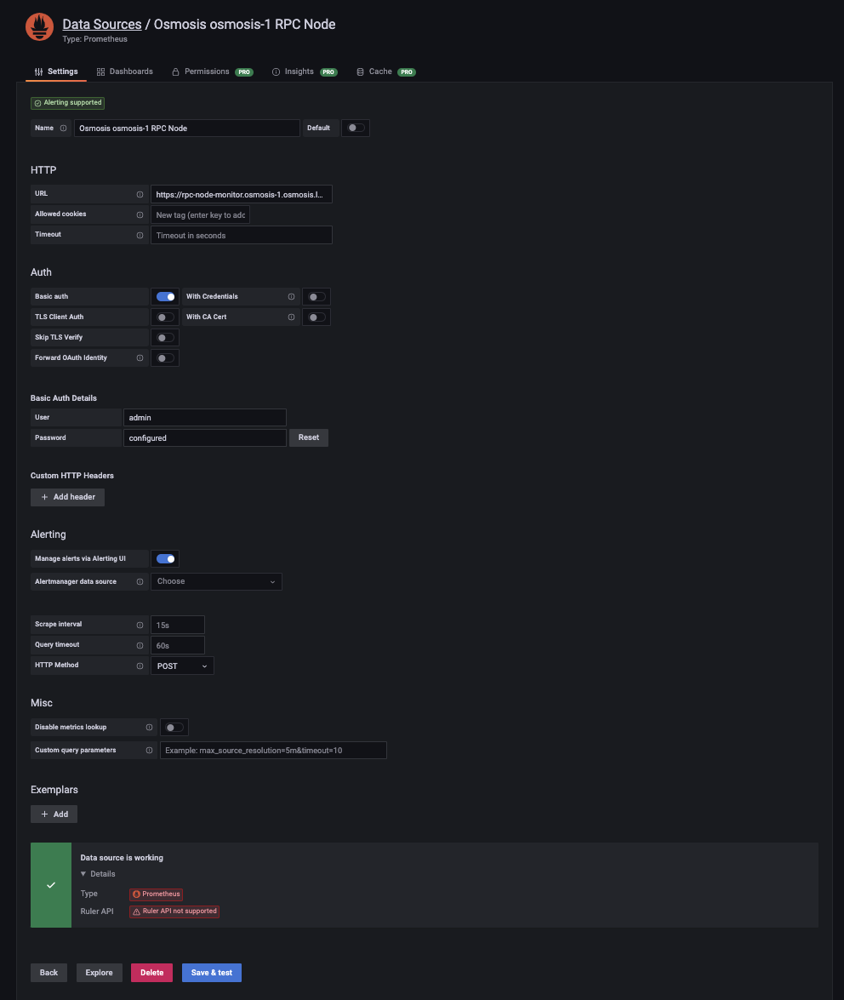
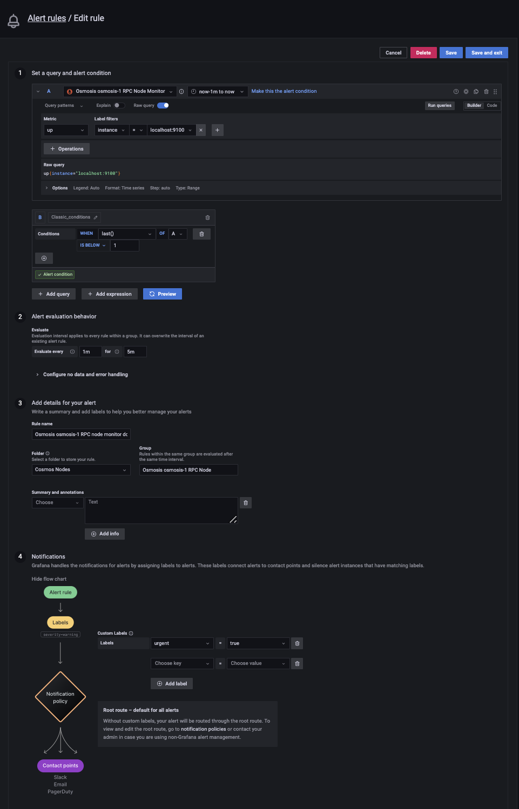

# Observability

This optional but recommended section explains how to set up monitoring and alerting. We explain it by using Prometheus, connecting Prometheus to Grafana Cloud, and using PANIC. Of course, you can run Grafana yourself, use an external Prometheus server, use [Tenderduty](https://github.com/blockpane/tenderduty), etc. instead. It's assumed that you've followed the [URL Setup](../url-setup.md) doc because this doc assumes URLs that look like https://rpc-node-1.osmosis-1.osmosis.example.com/blockchain-node.

1. Sign up for [Grafana Cloud](https://grafana.com/auth/sign-up/create-user).
2. On your Grafana Cloud instance, create an [API key](https://grafana.com/docs/grafana-cloud/reference/create-api-key/)s for the Prometheus integration with the **Role** set to **MetricsPublisher**. Note down the URL, username, and password for use later on.
3. Install Prometheus:

    ```shell
    cd
   
    ###############################
    ## BEGIN: Install Prometheus ##
    ###############################
   
    set PROM_URL https://github.com/prometheus/prometheus/releases/download/v2.37.0/prometheus-2.37.0.linux-amd64.tar.gz
    wget $PROM_URL
    tar xvzf (basename $PROM_URL)
    rm (basename $PROM_URL)

    #############################
    ## END: Install Prometheus ##
    #############################
   
    set DIR (basename $PROM_URL | sed 's|.tar.gz||')
   
    ####################################
    ## BEGIN: Set Grafana credentials ##
    ####################################
   
    set PROMPT 'Enter your Prometheus instance\'s URL such as'
    set PROMPT "$PROMPT https://prometheus-prod-10-prod-us-central-0.grafana.net/api/prom/push: "
    read -P $PROMPT GRAFANA_URL

    read -P 'Enter your Grafana username such as 986969: ' GRAFANA_USERNAME
   
    set PROMPT 'Enter your Grafana password such as'
    set PROMPT "$PROMPT oop09ikiM2YxZDJjOGY5YmJlODUxMmNpoiuyt2IzZDI3YWFlNzQyZGE2ZDdjYiIsIm4iOiJzZWktdGVzdG5ldC12Ykj3: "
    read -P $PROMPT GRAFANA_PASSWORD
   
    ##################################
    ## END: Set Grafana credentials ##
    ##################################
   
    ############################################################
    ## BEGIN: Set up basic auth for connections to Prometheus ##
    ############################################################
   
    sudo apt install -y apache2-utils
   
    printf 'You\'ll now be asked to enter a password which will be used for basic auth connections to Prometheus.\n'
    htpasswd -Bc auth.txt admin
    set PASSWORD (sed 's|admin:||' auth.txt)
    rm auth.txt
   
    printf "\
    basic_auth_users:
      admin: $PASSWORD
    " > $DIR/web.yml
   
    ##########################################################
    ## END: Set up basic auth for connections to Prometheus ##
    ##########################################################
    ```
4. Configure Prometheus using one of the following:
    - Only follow this step if you're monitoring a validator setup:

        ```shell
        read -P 'Enter the first sentry\'s hostname such as sentry-1.osmo-test-4.osmosis.example.com: ' SENTRY_1
        read -P 'Enter the second sentry\'s hostname such as sentry-2.osmo-test-4.osmosis.example.com: ' SENTRY_2
        read -P 'Enter the third sentry\'s hostname such as sentry-3.osmo-test-4.osmosis.example.com: ' SENTRY_3
      
        read -P 'Enter the first cosigner\'s hostname such as cosigner-1.osmo-test-4.osmosis.example.com: ' COSIGNER_1
        read -P 'Enter the first cosigner\'s hostname such as cosigner-2.osmo-test-4.osmosis.example.com: ' COSIGNER_2
        read -P 'Enter the first cosigner\'s hostname such as cosigner-3.osmo-test-4.osmosis.example.com: ' COSIGNER_3
 
        printf "\
        scrape_configs:
        - job_name: node-exporter-for-monitor
          static_configs:
          - targets: [localhost:9100]
        - job_name: blockchain-node-for-sentry-1
          static_configs:
          - targets: [$SENTRY_1]
          metrics_path: /blockchain-node
        - job_name: blockchain-node-for-sentry-2
          static_configs:
          - targets: [$SENTRY_2]
          metrics_path: /blockchain-node
        - job_name: blockchain-node-for-sentry-3
          static_configs:
          - targets: [$SENTRY_3]
          metrics_path: /blockchain-node
        - job_name: node-exporter-for-sentry-1
          static_configs:
          - targets: [$SENTRY_1]
          metrics_path: /node-exporter
        - job_name: node-exporter-for-sentry-2
          static_configs:
          - targets: [$SENTRY_2]
          metrics_path: /node-exporter
        - job_name: node-exporter-for-sentry-3
          static_configs:
          - targets: [$SENTRY_3]
          metrics_path: /node-exporter
        - job_name: node-exporter-for-cosigner-1
          static_configs:
          - targets: [$COSIGNER_1]
          metrics_path: /node-exporter
        - job_name: node-exporter-for-cosigner-2
          static_configs:
          - targets: [$COSIGNER_2]
          metrics_path: /node-exporter
        - job_name: node-exporter-for-cosigner-3
          static_configs:
          - targets: [$COSIGNER_3]
          metrics_path: /node-exporter
        remote_write:
        - url: $GRAFANA_URL
          basic_auth:
            username: $GRAFANA_USERNAME
            password: $GRAFANA_PASSWORD
        " > $DIR/prometheus.yml
        ```
    - Only follow this step if you're not monitoring a validator setup:

        ```shell
        read -P 'Enter the first full node\'s hostname such as rpc-node-1.osmosis-1.osmosis.example.com: ' FULL_NODE_1
        read -P 'Enter the second full node\'s hostname such as rpc-node-2.osmosis-1.osmosis.example.com: ' FULL_NODE_2
      
        printf "\
        scrape_configs:
      
        # Monitor
        - job_name: node-exporter-for-monitor
          static_configs:
          - targets: ['localhost:9100']
        
        # Blockchain nodes
        - job_name: blockchain-node-for-full-node-1
          static_configs:
          - targets: [$FULL_NODE_1]
          metrics_path: /blockchain-node
        - job_name: blockchain-node-for-full-node-2
          static_configs:
          - targets: [$FULL_NODE_2]
          metrics_path: /blockchain-node
      
        # Node Exporters
        - job_name: node-exporter-for-full-node-1
          static_configs:
          - targets: [$FULL_NODE_1]
          metrics_path: /node-exporter
        - job_name: node-exporter-for-full-node-2
          static_configs:
          - targets: [$FULL_NODE_2]
          metrics_path: /node-exporter
      
        remote_write:
        - url: $GRAFANA_URL
          basic_auth:
            username: $GRAFANA_USERNAME
            password: $GRAFANA_PASSWORD
        " > $DIR/prometheus.yml
        ```
5. Set up a systemd unit for Prometheus:

    ```shell
    printf "\
    [Unit]
    Description=Prometheus
    Wants=network-online.target
    After=network-online.target

    [Service]
    User=$USER
    ExecStart=/home/$USER/$DIR/prometheus --config.file=/home/$USER/$DIR/prometheus.yml --web.config.file=/home/$USER/$DIR/web.yml --web.listen-address=:6666 --storage.tsdb.path=/home/$USER/$DIR/data
    Restart=always
    RestartSec=3
    LimitNOFILE=4096

    [Install]
    WantedBy=multi-user.target
    " | sudo tee /etc/systemd/system/prometheus.service
   
    sudo systemctl enable --now prometheus
    sudo systemctl status prometheus
    ```
6. Monitor the monitoring system:
    1. [Add](https://grafana.com/docs/grafana/latest/datasources/add-a-data-source/) a Prometheus data source in Grafana Cloud, and connect it to the monitor. For example:

       
    2. [Create](https://grafana.com/docs/grafana/latest/alerting/alerting-rules/create-grafana-managed-rule/) a Grafana alert to notify you when the monitor is down so that you know to fix the monitor and/or manually monitor the blockchain nodes while the monitor is down. For example:

       
7. Set up [PANIC](https://github.com/SimplyVC/panic). If the website on port 3,333 doesn't open, open port 9,000, make an API call via the UI, open port 3,333 again, and wait about a minute - it should work now.
